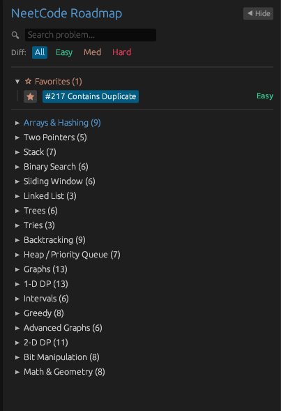
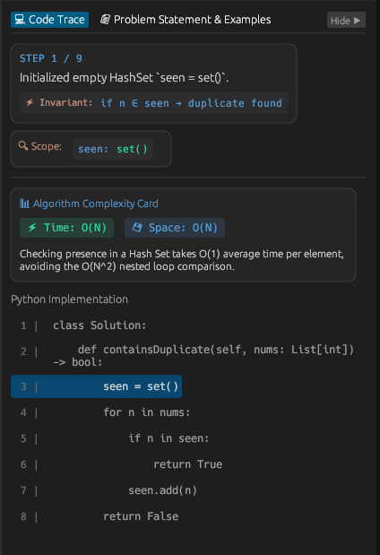
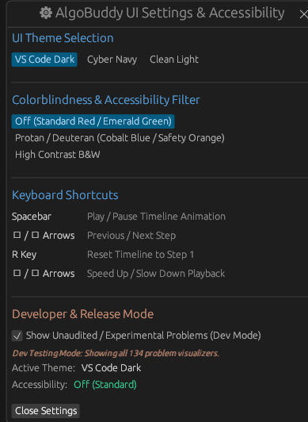
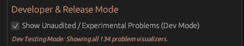

# AlgoBuddy

[](https://rowrow620.github.io/AlgoBuddy)

[](https://www.rust-lang.org/)
[](LICENSE)
[](https://github.com/emilk/egui)
[]()

> **[Try AlgoBuddy Live in Your Browser (No Installation Required)](https://rowrow620.github.io/AlgoBuddy)**


AlgoBuddy is a high-performance cross-platform application built in Rust using `eframe` and `egui` that provides interactive, step-by-step algorithm visualizations formatted according to the NeetCode 150 learning roadmap. Available natively on Windows/macOS/Linux or live in your browser via WebAssembly (WASM).


---


## Key Features

- **NeetCode 150 Category Taxonomy**: Navigation structured into 18 algorithmic topic categories including Arrays & Hashing, Two Pointers, Sliding Window, Stack, Binary Search, Linked List, Trees, Tries, Backtracking, Heap / Priority Queue, 1D Dynamic Programming, Bit Manipulation, Math & Geometry, Greedy, Intervals, Graphs, 2D Dynamic Programming, and Advanced Graphs.


- **Progressive Problem Auditing**: Actively auditing problem logic and visual step renderers across the roadmap to ensure 100% mathematical and code-trace precision before public release.


- **Full-Screen NeetCode 150 Mastery Dashboard**: Interactive category progress breakdown with custom problem completion checkmarks, reset controls, and automatic cross-session state persistence.


- **Interactive State Renderers**: Visualizes 2D DP memoization tables, graph vector topology canvas, grid flood fills, topological sorts, decision transitions, and step-by-step trace arrays.


- **Theme & Colorblind Accessibility System**: Live switcher supporting **VS Code Midnight Dark**, **Cyber Navy**, **Clean Light**, and **Protan/Deuteran Red-Green Colorblind Safe** palettes.


- **Multi-Approach Evaluation Engine**: Compare multiple valid solutions per problem with live execution updates.


- **Deterministic State Engine**: Models algorithm steps as discrete state snapshots, enabling forward and backward timeline scrubbing, variable speed multipliers (0.25x - 4.00x), and synchronized source line highlighting.


- **Integrated Problem Specifications**: View problem statements, examples with input/output cases, operational constraints, and direct links to official LeetCode problems within the application context.


---

## Core Features

- **Topic Navigation & Search**: Filter problems by topic category, difficulty level (Easy, Medium, Hard), or direct keyword search.

  

- **Visual Memory State Renderers**:
  - Interactive Array, 2D DP Memoization Table, Matrix Grid, 2D Vector Node Graph, Stack, Deque, HashSet, Trie Prefix Tree, Dual Heap Tree & Array, and Binary Tree renderers.
  - Two Pointers, Sliding Window, and Binary Search range & mid highlights.
- **Synchronized Source Trace & Live Scope Inspector**: Python solution implementation with active line highlighting tied to visual state transitions and live variable scope inspection.

  

---

## Public Release vs. Developer Mode

AlgoBuddy uses a strict **Audit Gating System** to ensure public users only see 100% verified, audited problem visualizers:

- **Public Release Mode** (Default): Shows fully audited and verified problems (currently **Contains Duplicate**, **Two Sum**, and **Valid Anagram**).
- **Developer / Testing Mode**: Unlocks all 134 problem visualizers across 18 categories for development, testing, and contribution.

  

  

---

## Installation & Execution

### Build from Source

Clone the repository and run via Cargo:

```powershell
git clone https://github.com/Rowrow620/AlgoBuddy.git
cd AlgoBuddy

# Launch Public Release Mode (Audited Problems)
cargo run

# Launch Developer / Testing Mode (All 134 Problems Unlocked)
cargo run -- --dev

# Run Automated Test Suite
cargo test
```

### WebAssembly (WASM) Deployment

To view Developer Mode in a browser deployment, append `?dev=true` to the URL (e.g., `https://rowrow620.github.io/AlgoBuddy/?dev=true`). You can also toggle Developer Mode anytime inside the application **Settings** modal.

---

## License

Distributed under the MIT License. See [LICENSE](LICENSE) for details.
