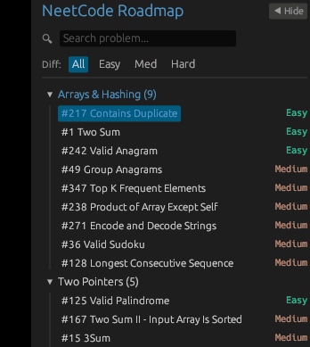

# AlgoBuddy

[](https://www.rust-lang.org/)
[](LICENSE)
[](https://github.com/emilk/egui)
[]()

AlgoBuddy is a native desktop application built in Rust using `eframe` and `egui` that provides interactive, step-by-step algorithm visualizations formatted according to the NeetCode 150 learning roadmap.



---


## Architectural Highlights

- **NeetCode 150 Category Taxonomy**: Navigation structured into 18 algorithmic topic categories including Arrays & Hashing, Two Pointers, Sliding Window, Stack, Binary Search, Linked List, Trees, Tries, Backtracking, Heap / Priority Queue, Graphs, Dynamic Programming, Bit Manipulation, and Math & Geometry.
- **Completion Milestones**:
  - **Progress**: 55 / 150 Problems Implemented (36.7% Roadmap Progress)
  - **100% Completed Categories (5/18)**: Arrays & Hashing (9/9), Two Pointers (5/5), Stack (6/6), Sliding Window (6/6), Binary Search (7/7)
  - **All Easy Problems (28/28)**: 100% Complete
- **Theme & Colorblind Accessibility System**: Live switcher supporting **VS Code Midnight Dark**, **Cyber Navy**, **Clean Light**, and **Protan/Deuteran Red-Green Colorblind Safe** palettes.
- **Multi-Approach Evaluation Engine**: Compare multiple valid solutions per problem with live execution updates.
- **Deterministic State Engine**: Models algorithm steps as discrete state snapshots, enabling forward and backward timeline scrubbing, variable auto-stepping delay (100ms - 1500ms), and synchronized source line highlighting.
- **Integrated Problem Specifications**: View problem statements, examples with input/output cases, operational constraints, and direct links to official LeetCode problems within the application context.

---

## Core Features

- **Topic Navigation & Search**: Filter problems by topic category, difficulty level (Easy, Medium, Hard), or direct keyword search.
- **Visual Memory State Renderers**:
  - Interactive Array, Matrix Grid, Stack, Deque, HashSet, and Binary Tree renderers.
  - Two Pointers, Sliding Window, and Binary Search range & mid highlights.
- **Synchronized Source Trace**: Python solution implementation with active line highlighting tied to visual state transitions.

---

## Installation & Execution

### Download Binary

Download the pre-compiled executable `AlgoBuddy-v0.5.0-Beta.exe` from the latest GitHub release.

### Build from Source

Clone the repository and build using Cargo:

```powershell
git clone https://github.com/Rowrow620/AlgoBuddy.git
cd AlgoBuddy
cargo run
```

---

## License

Distributed under the MIT License. See [LICENSE](LICENSE) for details.
